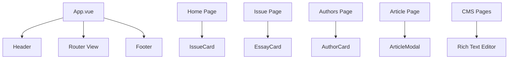

# System Patterns

## Архитектура системы

```
┌─────────────────────────────────────────────────────────┐
│                      Browser                            │
├─────────────────────────────────────────────────────────┤
│  Vue 3 App                                              │
│  ┌─────────────┐  ┌─────────────┐  ┌─────────────┐    │
│  │   Pages     │  │ Components  │  │   Stores    │    │
│  │   (Views)   │◄─┤   (UI)      │  │   (Pinia)   │    │
│  └─────────────┘  └─────────────┘  └─────────────┘    │
│         │                │                  │          │
│         │                │                  │          │
│         ▼                ▼                  ▼          │
│  ┌─────────────────────────────────────────────────┐  │
│  │              Router (Vue Router)                │  │
│  └─────────────────────────────────────────────────┘  │
│         │                                              │
│         ▼                                              │
│  ┌─────────────────────────────────────────────────┐  │
│  │           Data Layer (JSON → API)               │  │
│  └─────────────────────────────────────────────────┘  │
└─────────────────────────────────────────────────────────┘
```

## Ключевые технические решения

### 1. Модульная архитектура компонентов
- **Layout компоненты** — Header, Footer (общие для всех страниц)
- **Card компоненты** — переиспользуемые карточки (IssueCard, EssayCard, AuthorCard)
- **Modal компоненты** — модальные окна с единым API
- **UI компоненты** — базовые элементы (Button, ThemeToggle)

### 2. Управление состоянием (Pinia)
- **issues store** — номера журнала
- **authors store** — авторы
- **articles store** — статьи
- **ui store** — UI состояние (модалки, уведомления, тема)

### 3. Маршрутизация
```javascript
// Публичные маршруты
/                    → Home
/issue/:id           → Issue
/article/:id         → Article
/authors             → Authors
/authors/:id         → AuthorDetail
/about               → About

// CMS (требуют авторизации)
/cms                 → CMS Dashboard
/cms/issues          → Управление номерами
/cms/articles        → Управление статьями
/cms/authors         → Управление авторами
/cms/prepare         → Подготовка к печати
/cms/spine           → Калькулятор корешка
```

### 4. Стили через CSS переменные
- **design-tokens** в `variables.css`
- **Темизация** через переключение классов
- **Нейроморфные эффекты** в `neuromorphic.css`

## Взаимосвязи компонентов



## Шаблоны проектирования

### 1. Composition API
Все компоненты используют `<script setup>` синтаксис Vue 3.

### 2. Store Pattern (Pinia)
```javascript
// Пример store
import { defineStore } from 'pinia'

export const useIssuesStore = defineStore('issues', {
  state: () => ({ issues: [] }),
  getters: {
    getIssueById: (state) => (id) => state.issues.find(i => i.id === id)
  },
  actions: {
    async fetchIssues() { /* ... */ }
  }
})
```

### 3. Modal Pattern
Единый компонент Modal с slot'ами для контента.

### 4. Rich Text Editor
Интеграция contenteditable с панелью инструментов через `document.execCommand`.
